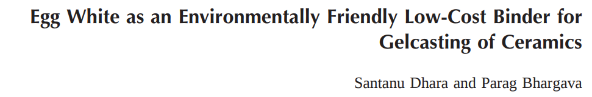
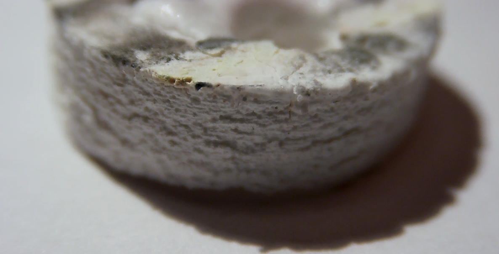

# Ceramics as she is spoke

<!---

pandoc --filter pandoc-citeproc --bibliography=references.bib -s furnace_quick.md -o paper.html

-->

[References](./references.pdf) | [BibTeX](./bibtex.bib) | [BibTeX](./bibtex.bib)

Safety note: At 1700 C, you can expect everything to be on fire. Parts with wet binders often explode, spraying superheated ceramic spall. Binder decomposition products can be pretty nasty. SiC elements have no insulation and present an electrocution hazard and also emit carbon monoxide. Working with aluminosilicate firebrick presents a risk of various pulmonology diseases and some (unsubstantiated) risk of neurological damage. Wear a respirator. Some techniques I'll mention eventually involve titanium, risking metal fume fever (see @Acute2008).

A while ago I was lucky enough to have the time to 

1. $30 "hot surface igniters" for gas heaters a really nice commodity source of silicon carbide heating elements, perfect for sintering high-temperature ceramics.

It's relatively easy to get to 800 C or so with standard heating elements or gas torches, which is sufficient for some low-fired >30% kaolin ceramic blends. With care in element support, termination, and insulation, commercial "high-fire" ceramics kilns can usually reach about 1300 C.

However, a very useful class of ceramics and techniques require a minimum of 1450 C, including sintering high-purity oxide ceramics, even if sinter-point-depressing additives are used. Furnaces which can reach such temperatures are extremely expensive. Small zirconium sintering kilns are available, ostensibly for dental work, usually using MoSi2 heating elements, but usually cost over $1500. Some alternative techniques include microwave sintering, field-assisted sintering (thanks @ice9); but these are not typically general-purpose.

More critically, if techniques require use in vacuum, standard chromium-based heating elements degrade very rapidly. See @mazelsky1974multipurpose :

> The next factor investigated was the suitability of Kanthal A-1 as heater material. Although this material is suitable for use to 1325 C in air, at least one reference does not recommend its use in vacuum at temperatures over 1000°C. This warning is founded in the rapid evaporation of a component (chromium?) from the alloy and verified by tests we performed on bare wires in ultra-high vacuum. Sample filaments burned out after two hours or less at a surface temperature of 1200°C.

If you're in a high vacuum or inert atmosphere, sufficiently pure graphite or tungsten boats can be an acceptable elements, but it takes some effort to work around the low resistance of these materials.

{ width=100% }

Note that 220V elements seem to be super rare: it seems to be hard to fabricate something with a sufficiently high resistance.

Aqueous gel-casting has a notable drawback for hobbyist use: almost all crosslinkers tend to entrain water, which takes many hours properly dry.

{ width=100% }

LPIM

{ width=50% }

tried molding, but it's kind of tricky and each part

The green is barely usable without a crosslinker; any handling will break it. @chabert suggest 2,5-dimethoxy 2,5-dihydrofuran, but Borax is more readily available - with the downside that thermal decomposition may emit highly toxic boron vapor.

*Hot Surface Ignitors* for central heating and gas stoves are an excellent commodity source of SiC elements for ultra-high-temp furnaces. Both SiC and SiNi HSIs are available; SiC greatly preferred due to higher temperature resistance. SiNi HSIs also often specify an 80v DC supply for reasons unknown.

SiC HSIs are mechanically delicate, but seem to tolerate ceramic spall and contamination.

Use `CoorsTek 271N` (or `Emerson 767A-372`) SiC HSI ($33 CAD, Amazon) or equivalent with fiberglass wire insulation, Steatite C220 or Alumina body, nichrome wire. Beware Teflon insulation.

Typical ratings: a tepid 980 C at 102v to a positively balmy 1705 C at 132v (@coorstek2017). Expect consistent 3.7A draw over entire temperature range.

{ width=50% }

Kiln built using single Amaco `28035N` 9" by 4-1/2" by 2-1/2" firebrick ($15, Amazon) cut and pocketed using a wet tile saw; the element was then mounted with fire-cement (*Imperial High-Temp Stove and Furnace Cement*). Let cement dry overnight, then slowly raise temperature over course of ~30 minutes.

The alumina-foam firebrick is quite delicate, and the end-cap to which the element was mounted later broke during handling. Mounting with threaded rods and large washers is recommended.

Depending on local line voltage and alumina purity, a variac may be required to raise voltage ~15% to reach a suitable sinter temperature.

I have a serious crush on this furnace. It typically reaches 1000c in one minute, and ~1400c in the next two, allowing for very rapid iterative testing (useful for my crude, blunderbuss style of R&D). It can also toast bread in 2.4 seconds. Some green binders (gelatine, specifically) were sensitive to temperature ramp rate; PVA seems unfazed by these crazy dT/dts.

Bread is not unfazed.

{ width=50% }

Expect element lifespan on the order of ~500 minutes at 130v: degradation occurs via a fascinating two-step interfacial oxidation reaction that evolves carbon monoxide and inflates large bubbles of SiO2 (if I'm understanding @raj2015 correctly - unlikely, given my chemistry prowess):

{ width=50% }

Interestingly, the same "bubbling" failure mode is seen on the reinforced-carbon-carbon panels on the  leading edges of the space shuttle, which are coated with SiO and SiC for oxidation protection.

This carbon-carbide conversion coating seems to be easy to perform in a furnace such as this one; see Tonsil 5 for details. SiC elements are also used on the ALQ-144 IR missile jammer, so it's unlikely that my laboratory will be hit with a missile in the near future.

A PID control system can be added with an SSR: P: 1, I: 1, D: 2 to 6 based on thermocouple response, and integral windup limits of -300, 300 seems to be an acceptable starting point.

{ width=50% }

Simple K-type thermocouple wire can operate briefly at 1300c; McMaster-Carr's #3859K44 thermocouples survive 1400c for a few seconds before being incinerated, though the high thermal mass leads to a ~200 C offset in this application (seen in the graph above).

A thin tungsten wire works well as a thermistor, but is rapidly oxidized. Nichrome also works well as a thermistor, though some brands seem to have a strange bijective resistivity curve. It is also destroyed in short order.

Non-contact temperature measurement is more suitable, though all COTS bolometers begin to whimper at these temperatures. A disappearing-filament pyrometer is trivial to build; if a spectrometer is available, fitting the pleasant glow of the furnace to the Stefan-Boltzmann law can get you within a few hundred degrees.

A ratio pyrometer built from two photodiodes (or phototransistors, depending on your bias) with IR-cut and IR-pass filters may also work. These techniques are complicated somewhat by alumina's selective radiation: the spectral emissivity curve looks like someone put overcooked pasta into Matplotlib.[^2] Worse still, it varies with temperature by about half an order of magnitude.  

All of this is for naught, however, since active control does not appear to be required with PVA. It appears that parts with repeatable properties can be made as long as the temperature is greater than the sinter point for sufficient time. The pause at 350c for binder burnout mentioned in @chabert2008cross did not seem to be necessary.

This process is not ideal for production: FAST/SPS has several advantages, including full-density sintering at only 1150c, and *as yet there's no consensus as to how it works*. It is *magic*. See @guillon2014field. Thanks to @ice9 for the tip!

Expect extremely low outgassing (even to LIGO standards), low permeability, continuous service temp ~1500c (with 90% mix - 70% mix became brittle at ~1600c), strength comparable to aluminum (with 70% mix - 90% mix is a little weaker), 20 MV/m breakdown at ambient, hardness Mohs ~9.

At low temperatures, you can expect extremely low outgassing (even to LIGO standards).

The alumina itself is not an outgassing concern; if you have success with purer alumina compositions, you can expect good vacuum performance all the way to ~1700c.

The clay binder is a somewhat different story. Pure Kaolin becomes Mullite above 1400c, which is as stable as alumina at low temperatures. However, silica impurities in the Kaolin may begin to sublimate to SiO at above 1300c. See @krieger1965thermodynamics for details; but in general, operation at above ~1400c is contraindicated.

Fired shrinkage values will be added soon.

{ width=50% }

> *Serves 12: bake till golden brown, then turn over.*

Apologies for the terse and hasty verbiage.

Post improvements or replication at <https://github.com/0xDBFB7/ceramic>, or hit me up @0xDBFB7 on Twitter!

❤

#### Tonsil 1: Brazing

Alumina can be readily brazed by the "active metal" process. In essence, this merely requires a titanium interface layer; an intermetallic is formed and the titanium adheres strongly to the alumina when molten, after which standard filler rods and brazing techniques can be used. The entire process must take place in a high vacuum or exceptionally clean argon atmosphere, else inert titanium oxides and nitrides will form.

A low-melting-point titanium alloy is usually used, as pure Ti melts at some 1800 C.

A soft copper or Kovar interface layer is often used to prevent differing thermal coefficients from cracking the ceramic when the weld cools.

See @hammond1988brazing and *Is it possible to braze ceramics?* *P.M.Roberts/Delphi Brazing Consultants* for details.

#### Tonsil 2: $MnO_2$

*Vitreous high alumina porcelain*, @luks1942vitreous, describes how Manganese Dioxide can be used to depress the sinter point of pure alumina to more reasonable temperatures, sometimes without the use of silica. An impure, graphite-contaminated $MnO_2$ can be obtained from alkaline batteries; unfortunately, I was not able to reproduce this effect to any degree.

#### Tonsil 3: Alternative binders

Almost any organic binder can be used.

#### Tonsil 4: Conductive graphite-impregnated

#### Tonsil 3: Cataphoresis

The initial solution can be thinned considerably, and various objects can be dipped to form hard coatings. Attempts with graphite and aluminum have been successful; however, obtaining a uniform, tight-tolerance layer is somewhat difficult.

If such a layer is required, a variant of electrophoresis can be used; see @lazic2004influence for details. This technique is often used to insulate indirectly heated cathodes.

#### Tonsil 4: Beta-alumina

Alumina can be found in two main allotropes: alpha-, and beta-. (well, and sapphire, but whatever).

To my (surely flawed) understanding, the chief difference lies in the ionic conductivity, which allows for hermetic low-temperature anodic bonds to some materials using the esoteric Johnsen–Rahbek effect. See Field-Assisted Bonding of Beta-Alumina to Metals, @dunn1979field.

#### Tonsil 5: Foam

If a thin gelatine binder is used in a sol-gel, the solution can be beaten like egg white into a low density insulating foam. I don't know what this is useful for, but it's neat.

#### Tonsil 6: Fire

{ width=50% }

> not sufficiently hot

{ width=50% }

> barely sufficiently hot

[^baking]: Is that how baking works? I don't know. I once substituted 3 cups of salt for sugar in a cake.

[^2]: Disappointed that 'spectral emissivity' has nothing to do with ghosts.

{ width=50% }

> Acetylene-sintered with 3% slip.
