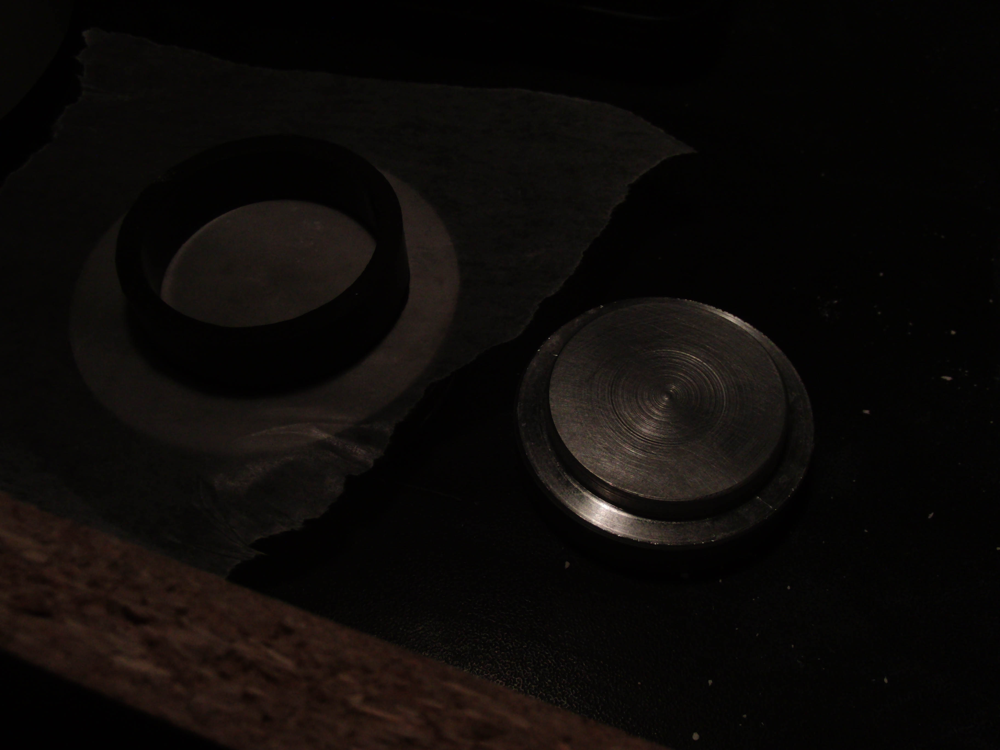
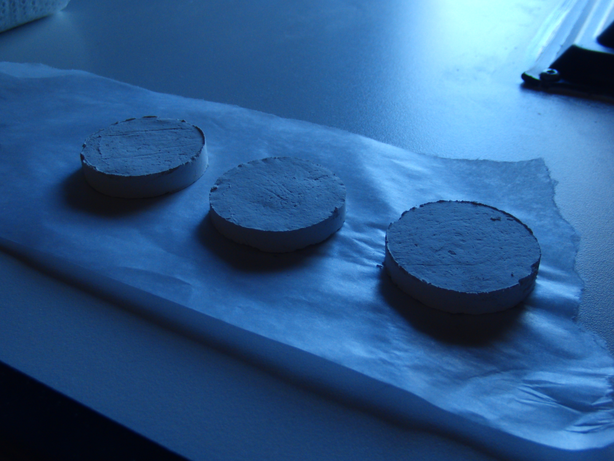

# Ceramics as she is spoke

A few months ago, it became apparent that a project would require several thousand high-temperature vacuum-safe ceramic insulators; and the economics would only work out if they could be produced in-house for less than <$0.03 each.

This is one of the lower quality parts. New ones have much lower porosity; image forthcoming.

Despite having tried numerous binders, I cannot say with any confidence that this is an ideal process; it is merely sufficient for my needs.

The recipe below is overly detailed: rest assured that the process only takes ~10 minutes plus a few hours of drying, and all materials and the required kiln can be procured for <$100.

If you're interested in trying this, I highly recommend skimming through the references. This process was taken almost verbatim from *Cross-linked Polyvinyl Alcohol as a Binder for Gelcasting and Green Machining*, with a few simplifications; a few minutes reading of the papers linked will probably be more enlightening than this purely empirical nonsense.

#### The recipe

Add 70 or 90% fine (calcined) Alumina powder to 30 or 10% Kaolin powder by weight, then mix 'til homogeneous. Add 4% by weight PVA white glue (*LePage general purpose white glue* known to work, 45 to 70% solids), then 14% water. 

Mix thoroughly until *cursed Parmesan* texture attained, then alternate adding water and mixing until the solution becomes a very thick putty. 30g batches suitable for manual mixing. 

Unlike reference, crosslinker not found to be required. Do not inhale dust; wear a respirator.

Molding with pressure is preferable to prevent voids. A three-piece mold of this style:

is required for reliable ejection: the green is too weak to eject with pins. This mold uses two aluminum dies and replaceable 40mm PVC pipe inserts for parallel drying without Amdahl; produces consistent 25g 1/4" thick wafers suitable for CNC milling. ~0.4 MPa pressure required for homogeneity; an 8 ton hydraulic press was used for these parts.

Beware granular jamming.

Wax paper effective for mold release.

Molding can produce a near-net-shape part, but green binder shrinkage will affect final dimensions. Machining dried green stock nulls out this shrinkage, and avoids the nuisance of unreliable molds.

Previous green binders were sensitive to variations in cross section; differential drying and shrinkage across thin geometries would cause cracking. PVA seems insensitive to these issues. 

Dry for 3-5 hours at ambient. The green is delicate, handle carefully. Machine at high rpm at ~100 m/min surface speed, expect very low cutting force. *Do not inhale dust.* Dust is highly abrasive, so ensure that axis guards are in place.

PVA hardens by dehydration, so failed mold shots or mill tailings can be reconstituted with water and added to future batch. 

Sinter at ~1450 C. 70% alumina requires ~10 minutes, 90%, ~30 minutes to a strength suitable for most applications. Do not move green after PLA burnout; it has zero strength. Parts with volume $<5mm^3$ can be unreliably but rapidly sintered via propane torch; very frustrating, not at all recommended. 

These temperatures are difficult to achieve via conventional ceramic kilns; *Hot Surface Ignitors* for central heating and gas stoves are an excellent commodity source of SiC elements for ultra-high temp furnaces. SiC and SiNi HSIs available; SiC greatly preferred due to higher temperature resistance. SiNi HSIs also often specify an 80v DC supply for reasons unknown.

SiC HSIs are mechanically delicate, but can tolerate ceramic spall and contamination. 

Use CoorsTek 271N (or Emerson 767A-372) SiC HSI ($33 CAD, Amazon) or equivalent with fiberglass wire insulation, Steatite C220 or Alumina body, nichrome wire. Beware Teflon insulation. 

Typical ratings: a chilly 980 C at 102v to a positively balmy 1705 C at 132v (@coorstek2017). Expect consistent 3.7A draw over entire temperature range.

Kiln built using single Amaco 28035N 9" by 4-1/2" by 2-1/2"  firebrick ($15, Amazon) cut using wet tile saw; element then mounted with fire-cement (*Imperial High-Temp Stove and Furnace Cement*). Wait ~12 hours for cement to dry, then slowly raise temperature over course of ~30 minutes. 

Depending on local line voltage and alumina purity, a variac may be required to raise voltage ~15% to reach suitable sinter temperature. 

I have a crush on this furnace. It's sinfully powerful. It typically reaches 1000c in one minute, and 1450c in the next two, allowing for very rapid iterative testing. It can also toast bread in 2.4 seconds. Some green binders were sensitive to temperature ramp rate; PVA seems unfazed by these crazy dT/dts. 

Expect element lifespan of ~10 30-minute cycles at 140v: degradation occurs via fascinating oxidation reaction that evolves carbon monoxide and inflates bubbles of SiO2:

A PID control system can be added with an SSR: P: 1, I: 1, D: 2 to 6 based on thermocouple response, and integral windup limits of -300, 300 seems to be an acceptable starting point.

Simple k-type thermocouples can operate briefly at 1300c; McMaster-Carr's #3859K44 thermocouples survive 1400c for a few seconds before being incinerated. A thin tungsten wire works well as a thermistor, but is rapidly oxidized. Nichrome also works well as a thermistor, though some brands have a strange bijective resistivity curve. It is also destroyed in short order. 

Non-contact temperature measurement is more suitable, though all bolometers begin to whimper at these temperatures. A disappearing-filament pyrometer is trivial to build; if a spectrometer is available, fitting the pleasant glow of the furnace to the Stefan-Boltzmann law can get you within a few hundred degrees. 

A ratio pyrometer built from two photodiodes (or phototransistors, depending on your bias) with IR-cut and IR-pass filters may also work. These techniques are somewhat complicated by the alumina's selective radiation: the spectral emissivity curve looks like someone put overcooked pasta into Matplotlib. Worse still, it varies with temperature by about half an order of magnitude.  

This process is not ideal for production: FAST/SPS has several advantages, including full-density sintering at only 1150c, and *there's no consensus as to how it works*. It is *magic*. Thanks to @ice9 on Twitter for the tip!

Expect extremely low outgassing (even to LIGO standards), low permeability, continuous service temp ~1500c (with 90% mix), strength comparable to aluminum, 20 MV/m breakdown at ambient, hardness Mohs ~9. 

Fired shrinkage values will be added soon.

Serves 12: bake till golden brown, then turn over.

A few thousand words used to be here, but it was largely garbage; a few months of inane, uninformative mistakes. Apologies for the terse and hasty wording; I must now learn all of Verilog in 3 hours for midterms. Apologies for the informal style: experimented with first-person, third-person scientific, etc, but everything sounded stilted and egomaniacal.

Post comments or improvements at <https://github.com/0xDBFB7/ceramic>, or hit me up @0xDBFB7 on Twitter.

♥

#### Tonsil 1: Brazing

Alumina can be readily brazed by the "active metal" process. In essence, this merely requires a titanium intermetallic layer; the titanium adheres strongly to the alumina when molten, after which standard filler rods and brazing techniques can be used. The whole process must take place in high vacuum or pure argon atmosphere. See  

#### Tonsil 2: Alternative binders

#### Tonsil 2: Cataphoresis

The initial solution can be thinned considerably, and various objects can be dipped to form hard coatings.

#### Tonsil 3: Beta-alumina

Alumina comes in two allotropes: alpha-alumina, and beta-alumina. 

To my (surely flawed) understanding, the chief difference lies in the ionic conductivity. The beta form can be produced by adding 9.6% Na2O, 0.25% Li2O  

See Field-Assisted Bonding of Beta-Alumina to Metals, @ dunn1979field. 

